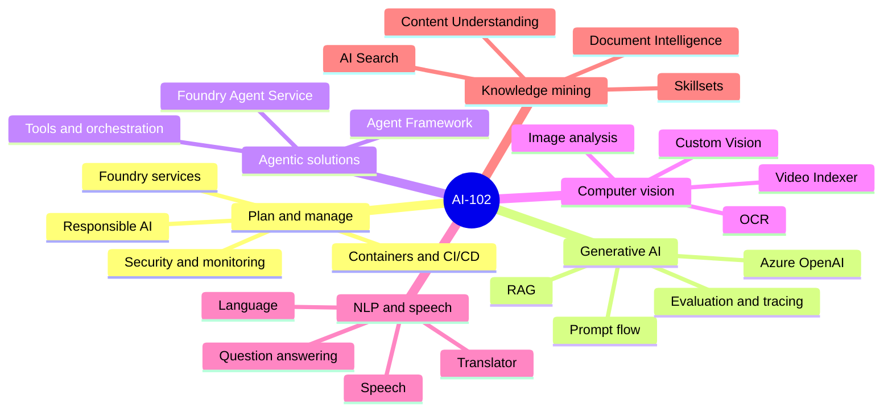
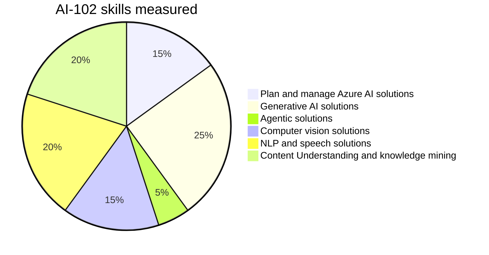
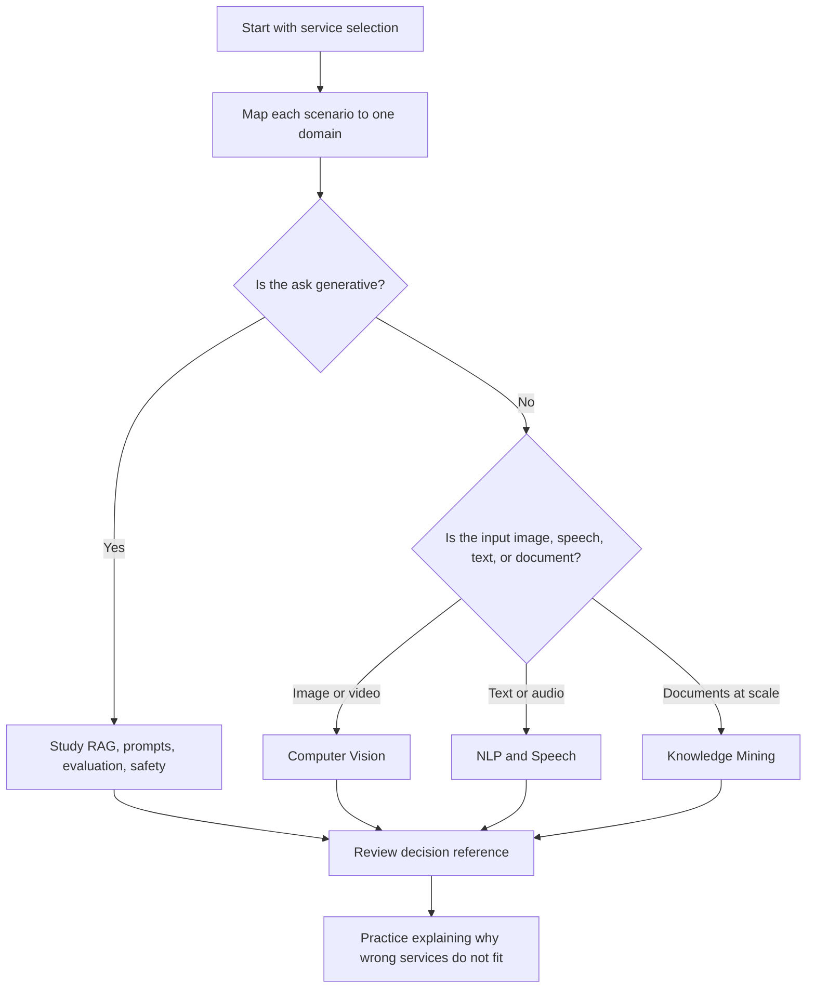

# AI-102 Visual Study Guide

> **Designing and Implementing a Microsoft Azure AI Solution**
> Aligned to the [Microsoft Learn AI-102 study guide](https://learn.microsoft.com/credentials/certifications/resources/study-guides/ai-102) and the official [skills measured](https://learn.microsoft.com/credentials/certifications/azure-ai-engineer/) for Exam AI-102. This is a concept study layer: visual notes, decision trees, and original summaries that map exam wording to the right Azure AI service. It does not reproduce exam questions.

Use it to build recognition: which Azure AI service fits the requirement, what deployment choice matters, and which scenario keywords point to which feature.

## Skills measured (official weights)

## Pages

| Page | Use it for |
| --- | --- |
| [Plan and Manage](01-plan-manage-ai-solution.md) | Service selection, deployment, security, monitoring, cost, Responsible AI. |
| [Generative AI](02-generative-ai-solutions.md) | Foundry, Azure OpenAI, RAG, prompt flow, model parameters, evaluation. |
| [Agentic Solutions](03-agentic-solutions.md) | Agents, tools, orchestration, multi-agent workflows, safety boundaries. |
| [Computer Vision](04-computer-vision.md) | Image analysis, OCR, Custom Vision, Video Indexer, Spatial Analysis. |
| [NLP and Speech](05-natural-language-speech.md) | Language, Translator, Speech, CLU, question answering, bot clues. |
| [Knowledge Mining](06-knowledge-mining-document-intelligence.md) | AI Search, indexers, skillsets, knowledge store, Document Intelligence. |
| [Exam Decision Reference](07-exam-cheatsheet.md) | Fast service picks, scenario clues, decision tables. |
| [Concept & Reference Index](09-references.md) | Every concept linked to Microsoft Learn. |
| [Extra Concepts](08-extra-ai102-concepts.md) | Exam-adjacent patterns, modernization notes, and quick mental models. |
| [Microsoft Learn Summaries](10-learn-summaries.md) | Per-service overviews + recreated architecture diagrams. |
| [Architectures - AI-102](10-arch-ai102.md) | Reference architectures from the Azure Architecture Center mapped to each skill area. |

## Study Route

## High-Yield Exam Skill

AI-102 rewards service fit more than memorized syntax. When a question gives a business requirement, ask:

1. What is the input type?
2. What output is required?
3. Is the solution prebuilt, custom-trained, generative, search-based, or agentic?
4. Does it require monitoring, security, Responsible AI, private networking, scale, or containers?
5. Which service is the narrowest match?
