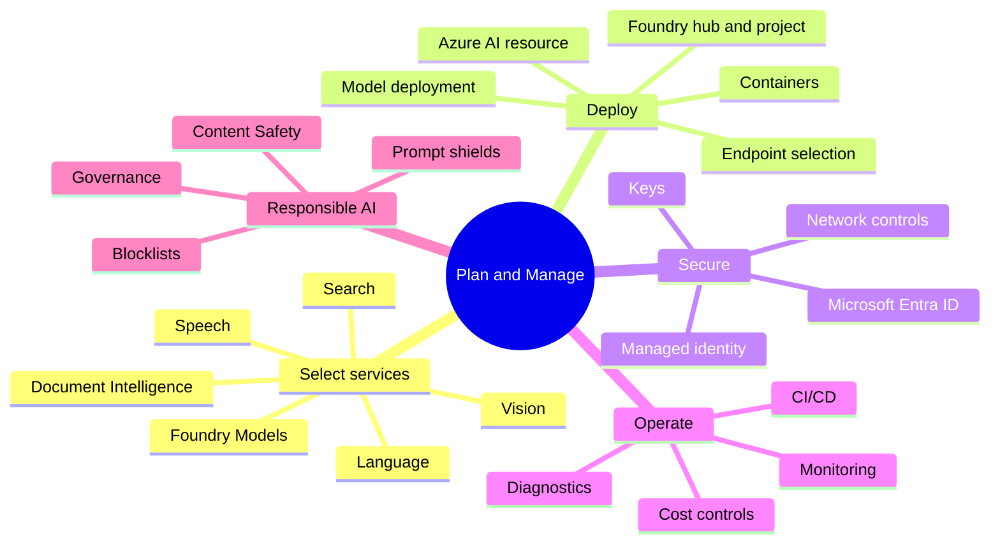
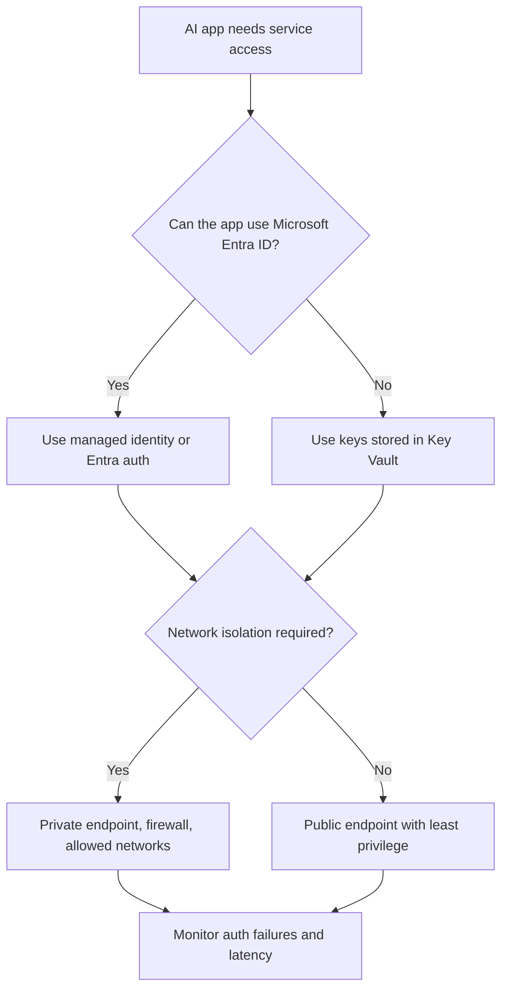
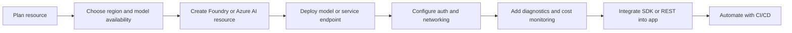

# Plan And Manage An Azure AI Solution

> Maps to AI-102 measured skill **Plan and manage an Azure AI solution** (~15-20%).
> Reference: [Microsoft Learn AI-102 study guide](https://learn.microsoft.com/credentials/certifications/resources/study-guides/ai-102) - [Azure AI services overview](https://learn.microsoft.com/azure/ai-services/what-are-ai-services) - [Microsoft Foundry](https://learn.microsoft.com/azure/ai-foundry/what-is-azure-ai-foundry) - [Responsible AI](https://learn.microsoft.com/azure/machine-learning/concept-responsible-ai) - [Azure AI containers](https://learn.microsoft.com/azure/ai-services/cognitive-services-container-support).

This domain is the control plane for the exam: service selection, deployment shape, security, monitoring, cost, containers, and Responsible AI. If a question asks for the right service before implementation details, start here.

## Service Selection Map

| Requirement clue | Strong first pick | Why |
| --- | --- | --- |
| Generate natural language, code, summaries, images, or multimodal responses | Azure OpenAI in Foundry Models | Generative model endpoint with model deployment choices. |
| Ground a model in private documents | Azure OpenAI plus AI Search | RAG needs retrieval, chunking, embeddings, and citations. |
| Extract fields from invoices, receipts, IDs, tax forms, or custom forms | Azure Document Intelligence | Document layout and field extraction. |
| Search PDFs, images, and structured content with enrichment | Azure AI Search | Indexes, indexers, skillsets, semantic/vector search, knowledge store. |
| Detect language, sentiment, PII, key phrases, entities | Azure AI Language | Text analytics and custom language tasks. |
| Translate text or documents | Azure AI Translator | Translation and language detection for translation workflows. |
| Convert speech to text or text to speech | Azure AI Speech | Audio processing, voices, SSML, custom speech. |
| Analyze images, OCR images, classify images, detect objects | Azure AI Vision or Custom Vision | Prebuilt visual features or custom image models. |
| Moderate prompts, generated text, images, or unsafe content | Azure AI Content Safety | Harm categories, blocklists, prompt shields. |
| Build a tool-using assistant | Foundry Agent Service or Agent Framework | Agent instructions, tools, memory/workflow orchestration. |

## Security Decision Tree

## Responsible AI Controls

| Need | Control |
| --- | --- |
| Detect harmful generated content | Content filters or Content Safety classification. |
| Stop prompt injection and jailbreak attempts | Prompt shields and groundedness checks. |
| Block organization-specific phrases | Custom blocklists. |
| Explain governance expectations | Responsible AI governance framework with owners, review, monitoring, and escalation. |
| Reduce privacy risk | PII detection, data minimization, redaction, and secure storage. |

## Deployment And Operations

## Gotchas

| Trap | Better thinking |
| --- | --- |
| Choosing a broad multi-service resource when the question asks for a specific capability | Pick the service that directly owns the capability. |
| Treating keys as the preferred secure auth method | Managed identity and Entra ID are preferred when supported. |
| Ignoring region availability | Generative and specialty models are not available everywhere. |
| Confusing content moderation with Responsible AI governance | Moderation is a control; governance includes process, accountability, monitoring, and policy. |
| Assuming containers remove Azure dependency | Containers often still require billing endpoint, keys, and compliance with connected requirements. |

## Quick Decision Picks

- Foundry is the project and model workspace lens.
- Azure AI resource is the service endpoint lens.
- Managed identity beats embedded keys when possible.
- Content Safety handles harm categories, blocklists, and prompt defenses.
- Monitor both service health and model/app behavior.

---

## References (Microsoft Learn)

- [AI-102 study guide](https://learn.microsoft.com/credentials/certifications/resources/study-guides/ai-102)
- [Azure AI services overview](https://learn.microsoft.com/azure/ai-services/what-are-ai-services)
- [Microsoft Foundry hubs and projects](https://learn.microsoft.com/azure/ai-foundry/concepts/ai-resources)
- [Authentication - keys, Entra ID, managed identity](https://learn.microsoft.com/azure/ai-services/authentication)
- [Azure AI containers](https://learn.microsoft.com/azure/ai-services/cognitive-services-container-support)
- [Azure AI Content Safety](https://learn.microsoft.com/azure/ai-services/content-safety/overview)
- [Responsible AI for Azure AI services](https://learn.microsoft.com/azure/ai-services/responsible-use-of-ai-overview)
- [Monitor Azure AI services](https://learn.microsoft.com/azure/ai-services/diagnostic-logging)
- [Cost management for Azure AI](https://learn.microsoft.com/azure/ai-services/plan-manage-costs)
