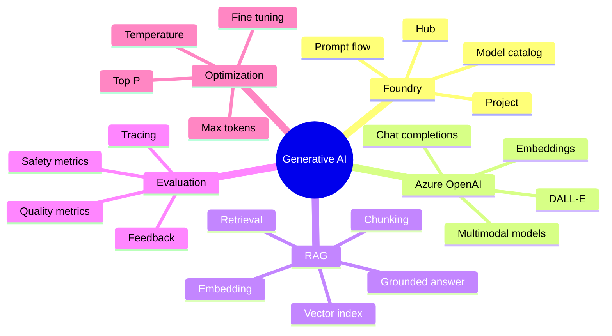
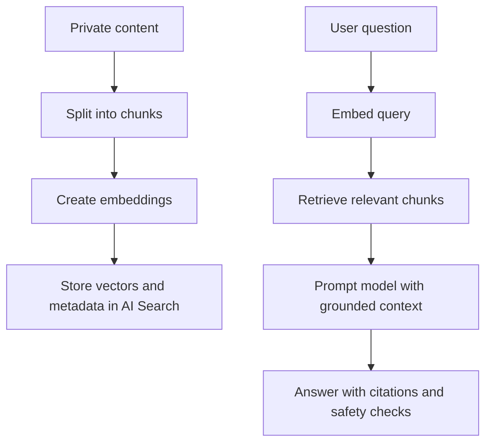
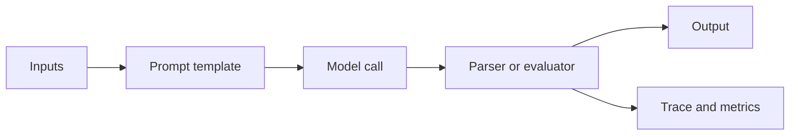

# Implement Generative AI Solutions

> Maps to AI-102 measured skill **Implement generative AI solutions** (~15-20%).
> Reference: [Microsoft Learn AI-102 study guide](https://learn.microsoft.com/credentials/certifications/resources/study-guides/ai-102) - [Azure OpenAI in Microsoft Foundry](https://learn.microsoft.com/azure/ai-foundry/openai/overview) - [Prompt flow](https://learn.microsoft.com/azure/ai-foundry/how-to/prompt-flow) - [Retrieval-augmented generation](https://learn.microsoft.com/azure/search/retrieval-augmented-generation-overview) - [Foundry evaluation](https://learn.microsoft.com/azure/ai-foundry/concepts/evaluation-approach-gen-ai).

Generative AI questions ask you to deploy the right model, shape prompts, ground responses, evaluate quality, and operate the solution safely. The exam often hides this domain inside application scenarios such as chat over documents, image generation, summarization, or model monitoring.

## RAG Flow

## Model And Pattern Choices

| Need | Choose | Watch for |
| --- | --- | --- |
| Chat, reasoning, summarization, code | Chat/completions model | Deployment name, region, token limits. |
| Semantic similarity or vector search | Embedding model | Same embedding model for indexing and querying. |
| Generate images | DALL-E image model | Prompt safety and image policy. |
| Use private documents | RAG with AI Search | Chunking, citations, freshness, access control. |
| Improve domain style from examples | Fine-tuning | Requires data quality and operational evaluation. |
| Visual or mixed text-image input | Multimodal model | Input format and model availability. |

## Parameter Clues

| Parameter | Exam meaning |
| --- | --- |
| `temperature` | Higher means more creative and variable; lower means more deterministic. |
| `top_p` | Nucleus sampling; controls diversity by probability mass. |
| `max_tokens` | Caps output length and cost. |
| system message | Sets behavior, role, and constraints. |
| prompt template | Reusable prompt structure with variables. |

## Prompt Flow Mental Model

## Operational Checklist

| Concern | What to configure |
| --- | --- |
| Quality | Evaluation dataset, model comparison, prompt experiments. |
| Safety | Content filters, prompt shields, blocklists, groundedness checks. |
| Cost | Token budgets, model choice, caching, scalable deployment. |
| Observability | Tracing, diagnostics, latency, feedback capture. |
| Reliability | Retries, fallback messages, rate limit handling. |

## Gotchas

- RAG is not fine-tuning. RAG retrieves facts at runtime; fine-tuning changes model behavior from examples.
- Embeddings are for similarity, not final natural-language answers.
- Lower temperature is usually better for factual enterprise assistants.
- Evaluation is not just manual testing; use datasets, metrics, traces, and feedback loops.
- Grounding reduces hallucination risk, but safety filters and prompt defenses are still needed.

---

## References (Microsoft Learn)

- [AI-102 study guide](https://learn.microsoft.com/credentials/certifications/resources/study-guides/ai-102)
- [Azure OpenAI in Microsoft Foundry](https://learn.microsoft.com/azure/ai-foundry/openai/overview)
- [Foundry model catalog](https://learn.microsoft.com/azure/ai-foundry/how-to/model-catalog-overview)
- [Deploy and consume models](https://learn.microsoft.com/azure/ai-foundry/how-to/deploy-models-openai)
- [Prompt engineering techniques](https://learn.microsoft.com/azure/ai-foundry/openai/concepts/prompt-engineering)
- [Retrieval-augmented generation overview](https://learn.microsoft.com/azure/search/retrieval-augmented-generation-overview)
- [Prompt flow](https://learn.microsoft.com/azure/ai-foundry/how-to/prompt-flow)
- [Evaluation in Foundry](https://learn.microsoft.com/azure/ai-foundry/concepts/evaluation-approach-gen-ai)
- [Azure AI Content Safety](https://learn.microsoft.com/azure/ai-services/content-safety/overview)
