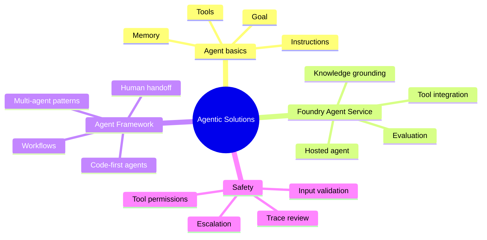
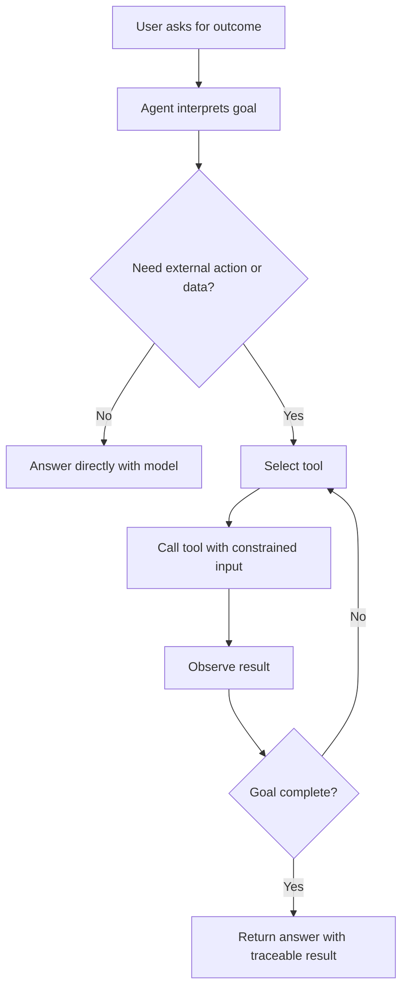
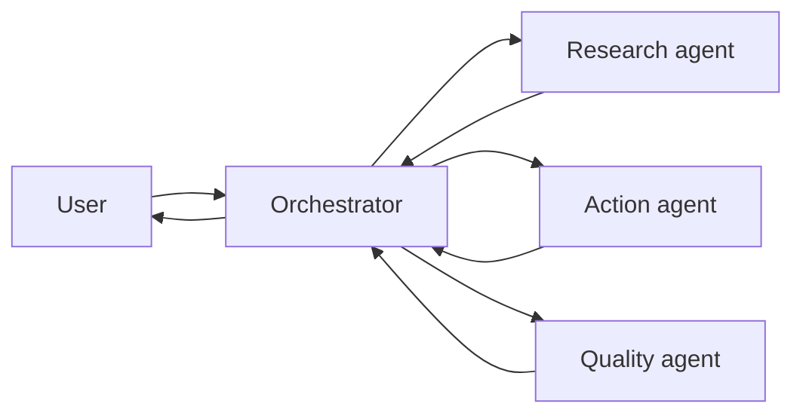

# Implement Agentic Solutions

> Maps to AI-102 measured skill **Implement agentic solutions** (~10-15%).
> Reference: [Microsoft Learn AI-102 study guide](https://learn.microsoft.com/credentials/certifications/resources/study-guides/ai-102) - [Foundry Agent Service](https://learn.microsoft.com/azure/ai-foundry/agents/overview) - [Microsoft Agent Framework](https://learn.microsoft.com/agent-framework/overview) - [Tools and function calling](https://learn.microsoft.com/azure/ai-foundry/openai/how-to/function-calling) - [Tracing](https://learn.microsoft.com/azure/ai-foundry/how-to/develop/trace-application).

Agentic questions focus on AI systems that can decide steps, use tools, call APIs, and coordinate workflows. Keep the distinction clear: a generative model produces responses; an agent uses a model plus instructions, tools, state, and orchestration.

## Agent Decision Path

## Foundry Agent Service Vs Agent Framework

| Need | Better fit |
| --- | --- |
| Hosted agent with managed service capabilities | Foundry Agent Service. |
| Code-first orchestration, custom workflows, complex multi-agent logic | Microsoft Agent Framework. |
| Fast prototype with managed tools and project integration | Foundry Agent Service. |
| Deep app integration with custom state and business rules | Agent Framework. |

## Tool Safety

| Risk | Control |
| --- | --- |
| Agent calls destructive API | Least-privilege tool permissions and explicit confirmation. |
| Prompt injection changes tool behavior | Strong instructions, prompt shields, allowlisted tools. |
| Sensitive data leaks through tool output | Redaction, data classification, output filtering. |
| Long autonomous loops | Step limits, budget limits, timeout and human handoff. |

## Multi-Agent Pattern

## Exam Clues

- "Use tools," "take actions," "autonomous," "multi-step," and "workflow" point to agents.
- "Multiple specialists" or "handoff" points to orchestration and multi-agent design.
- "Code-first complex workflow" points toward Agent Framework.
- "Managed hosted agent in a Foundry project" points toward Foundry Agent Service.
- "Prevent unsafe actions" points to tool restrictions, confirmations, tracing, and safety filters.

---

## References (Microsoft Learn)

- [AI-102 study guide](https://learn.microsoft.com/credentials/certifications/resources/study-guides/ai-102)
- [Foundry Agent Service overview](https://learn.microsoft.com/azure/ai-foundry/agents/overview)
- [Microsoft Agent Framework](https://learn.microsoft.com/agent-framework/overview)
- [Tool / function calling in Azure OpenAI](https://learn.microsoft.com/azure/ai-foundry/openai/how-to/function-calling)
- [Connected agents and orchestration](https://learn.microsoft.com/azure/foundry/agents/concepts/workflow)
- [Tracing and observability](https://learn.microsoft.com/azure/ai-foundry/how-to/develop/trace-application)
- [Responsible AI for agents](https://learn.microsoft.com/legal/ai-code-of-conduct)
