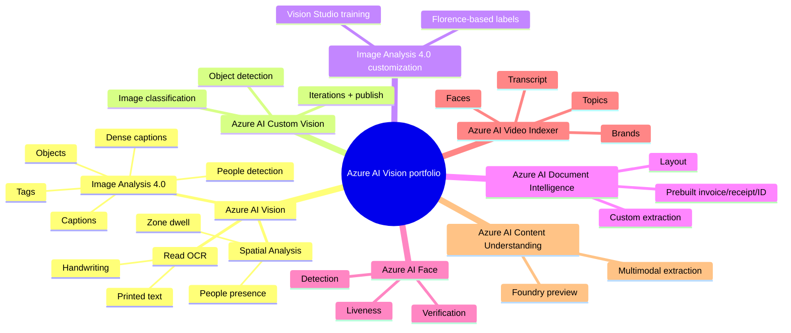
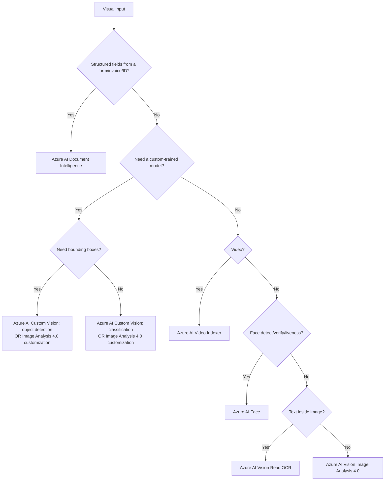

# Implement Computer Vision Solutions

> Maps to AI-102 measured skill **Implement computer vision solutions** (~15-20%).
> Reference: [Microsoft Learn AI-102 study guide](https://learn.microsoft.com/credentials/certifications/resources/study-guides/ai-102) - [Azure AI Vision](https://learn.microsoft.com/azure/ai-services/computer-vision/overview) - [Image Analysis 4.0](https://learn.microsoft.com/azure/ai-services/computer-vision/concept-tag-images-40) - [Custom Vision](https://learn.microsoft.com/azure/ai-services/custom-vision-service/overview) - [Document Intelligence](https://learn.microsoft.com/azure/ai-services/document-intelligence/overview) - [Azure AI Video Indexer](https://learn.microsoft.com/azure/azure-video-indexer/video-indexer-overview) - [Azure AI Face](https://learn.microsoft.com/azure/ai-services/computer-vision/overview-identity) - [Azure AI Content Understanding](https://learn.microsoft.com/azure/ai-services/content-understanding/overview).

> [!IMPORTANT]
> **Memorize the exact Azure service names - the exam uses them verbatim.** Most rebrands happened in 2023-2024:
> | What it does | Old name (pre-rebrand) | **Current official name** |
> | --- | --- | --- |
> | Tags/captions/objects/OCR on images | Computer Vision | **Azure AI Vision** |
> | Image Analysis with Florence foundation model | Image Analysis 3.x | **Azure AI Vision Image Analysis 4.0** |
> | OCR / handwriting / printed text | Computer Vision Read API | **Azure AI Vision Read OCR** (a.k.a. Read API) |
> | Custom image classification + object detection | Custom Vision | **Azure AI Custom Vision** *(legacy - see note)* |
> | Custom image labels with Florence | n/a | **Azure AI Vision Image Analysis 4.0 - model customization** |
> | Forms, invoices, receipts, IDs | Azure AI Document Intelligence | **Azure AI Document Intelligence** |
> | Face detection / verification / liveness | Face API | **Azure AI Face** *(limited-access gated)* |
> | Video transcript + insights | Video Indexer | **Azure AI Video Indexer** |
> | Multimodal (image + audio + video + doc) extraction in Foundry | n/a | **Azure AI Content Understanding** *(Foundry, preview)* |
> | Browser UI to try Vision/Face/Document Intelligence | Azure AI Foundry portal | **Vision Studio** *(under Azure AI Foundry portal)* |
> | People-flow/zone analytics on camera feeds | n/a | **Azure AI Vision Spatial Analysis** *(container only)* |

Vision questions test whether you choose **prebuilt visual analysis**, **OCR**, **custom-trained models**, or **video insights**. Always start with the input: still image, scanned document, live video, prerecorded video, or labeled training images.

## Vision Service Decision Tree (use the exact names on the exam)

## Prebuilt Visual Features - `Azure AI Vision Image Analysis 4.0`

| Feature (exam wording) | Use when |
| --- | --- |
| **Tags** | Need broad labels for image content. |
| **Caption** / **Dense Captions** | Need human-readable description / alt text. |
| **Objects** | Need object names + bounding boxes (no training). |
| **People** | Need people detection (not identity). |
| **Read** (OCR) | Need printed or handwritten text extraction. |
| **Smart crop** | Generate thumbnails focused on salient region. |

## Custom-trained Models - Two Choices

| Requirement | Choose |
| --- | --- |
| Categorize whole image into one or more classes | **Azure AI Custom Vision - image classification** *or* **Image Analysis 4.0 model customization (multi-label)** |
| Locate where objects appear | **Azure AI Custom Vision - object detection** *or* **Image Analysis 4.0 model customization (object detection)** |
| Few labeled images, want better accuracy | Prefer **Image Analysis 4.0 model customization** (Florence backbone, fewer images needed). |
| Existing project from before 2023 | Stay on **Azure AI Custom Vision** until migrated. |
| Improve poor precision/recall | Add better-labeled images and **train a new iteration**. |
| Consume model from app | **Publish iteration -> call prediction endpoint** (Custom Vision) or call Image Analysis customization endpoint. |

> [!NOTE]
> **Custom Vision is still GA but is being superseded by `Azure AI Vision Image Analysis 4.0` model customization** (Florence foundation model). On the exam, either name can appear; pick whichever matches the question's wording. If the question stresses *foundation-model-based / few-shot custom labels*, that's Image Analysis 4.0 customization.

## Metrics - Custom Vision / Image Analysis 4.0 customization

| Metric | Meaning |
| --- | --- |
| **Precision** | Of predicted positives, how many were correct (fewer false positives). |
| **Recall** | Of actual positives, how many were found (fewer false negatives). |
| **mAP** (mean Average Precision) | Object-detection quality across classes/thresholds. |
| **Probability threshold** | Higher -> precision up, recall down. |

## Video & Spatial

- **Azure AI Video Indexer** - transcript, faces, brands, labels, keywords, sentiment, topics, scenes from prerecorded video. *Use when the question says "search inside video" or "extract insights from a video file".*
- **Azure AI Vision Spatial Analysis** - people presence, zone dwell, person-count, line-crossing on **live camera streams**. Runs **only in a container** (edge/IoT). *Use when the question mentions retail/safety analytics from cameras.*

## Document Intelligence vs Vision OCR - common trap

| Need | Service |
| --- | --- |
| Pull **structured fields** (invoice total, vendor, date) | **Azure AI Document Intelligence** (prebuilt invoice / receipt / ID / business-card / W-2 / health-insurance / contract / layout / **custom**). |
| Just get **text + bounding boxes** out of an image or PDF | **Azure AI Vision Read OCR**. |
| Multimodal extract from doc + audio + image + video in one pipeline | **Azure AI Content Understanding** (Foundry). |

## Gotchas

- The service formerly called **Computer Vision** is now **Azure AI Vision** - same key/endpoint, new name on the exam.
- **OCR from images = Azure AI Vision Read**; **structured form fields = Azure AI Document Intelligence**. Don't swap them.
- **Object detection returns bounding boxes; classification does not.**
- **Azure AI Face** identification, verification, and liveness require **Limited Access** approval - never assume broad face recognition is available.
- **Caption / Dense Captions** generate human-readable descriptions, not custom business labels.
- **Spatial Analysis runs only in containers** - there is no cloud-hosted REST endpoint.

---

## References (Microsoft Learn)

- [AI-102 study guide](https://learn.microsoft.com/credentials/certifications/resources/study-guides/ai-102)
- [Azure AI Vision overview](https://learn.microsoft.com/azure/ai-services/computer-vision/overview)
- [Image Analysis 4.0](https://learn.microsoft.com/azure/ai-services/computer-vision/concept-tag-images-40)
- [Image Analysis 4.0 model customization](https://learn.microsoft.com/azure/ai-services/computer-vision/how-to/model-customization)
- [Read OCR](https://learn.microsoft.com/azure/ai-services/computer-vision/overview-ocr)
- [Azure AI Custom Vision](https://learn.microsoft.com/azure/ai-services/custom-vision-service/overview)
- [Azure AI Document Intelligence](https://learn.microsoft.com/azure/ai-services/document-intelligence/overview)
- [Azure AI Face](https://learn.microsoft.com/azure/ai-services/computer-vision/overview-identity)
- [Azure AI Vision Spatial Analysis](https://learn.microsoft.com/azure/ai-services/computer-vision/intro-to-spatial-analysis-public-preview)
- [Azure AI Video Indexer](https://learn.microsoft.com/azure/azure-video-indexer/video-indexer-overview)
- [Azure AI Content Understanding](https://learn.microsoft.com/azure/ai-services/content-understanding/overview)
- [Vision Studio](https://portal.vision.cognitive.azure.com/)