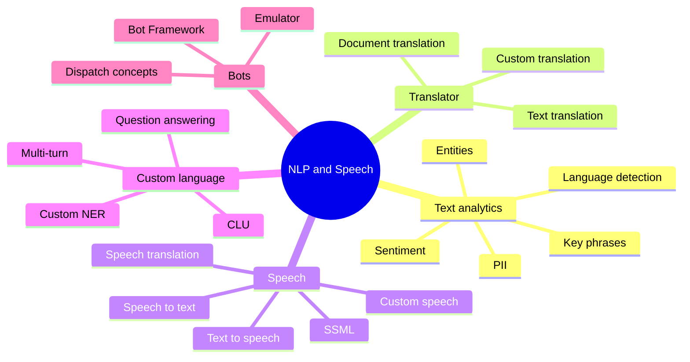
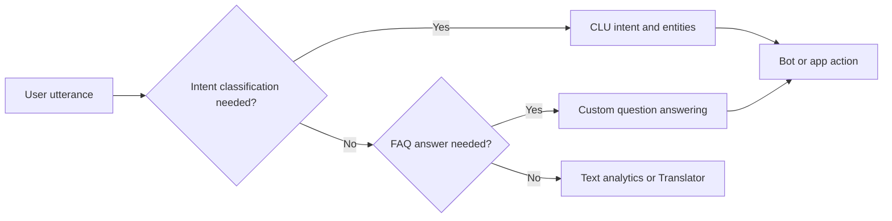

# Implement Natural Language Processing And Speech Solutions

> Maps to AI-102 measured skill **Implement natural language processing and speech solutions** (~15-20%).
> Reference: [Microsoft Learn AI-102 study guide](https://learn.microsoft.com/credentials/certifications/resources/study-guides/ai-102) - [Azure AI Language](https://learn.microsoft.com/azure/ai-services/language-service/overview) - [Conversational Azure AI Language CLU](https://learn.microsoft.com/azure/ai-services/language-service/conversational-language-understanding/overview) - [Custom question answering](https://learn.microsoft.com/azure/ai-services/language-service/question-answering/overview) - [Azure AI Translator](https://learn.microsoft.com/azure/ai-services/translator/translator-overview) - [Azure AI Speech](https://learn.microsoft.com/azure/ai-services/speech-service/overview).

This is one of the largest service clusters on the exam: Language, Speech, Translator, CLU, custom question answering, bots, and the older LUIS / QnA Maker terminology. The current exam emphasizes Azure AI Language, Translator, Speech, and Foundry tools, but older names still appear in explanations and migration scenarios.

## Text Service Decision Table

| Requirement clue | Service or feature |
| --- | --- |
| Identify language of text | Language detection or Translator detect when translation workflow follows. |
| Convert text from one language to another | Translator. |
| Extract people, places, organizations, dates | Named entity recognition. |
| Extract domain-specific entities like part numbers or contract IDs | Custom NER. |
| Detect positive, neutral, negative tone | Sentiment analysis. |
| Remove or detect private data | PII detection. |
| Map utterances to intents in a bot | Conversational Azure AI Language CLU. |
| Answer FAQs from curated sources | Custom question answering. |

## CLU And Question Answering

## Speech Choices

| Requirement | Choose |
| --- | --- |
| Convert audio to text | Speech to text. |
| Convert text to audio | Text to speech. |
| Control pronunciation, pauses, pitch, rate, voice style | SSML. |
| Improve recognition for specialized vocabulary | Custom speech. |
| Detect wake word or spoken intent | Keyword recognition or intent recognition. |
| Translate spoken input | Speech translation. |

## Bot Debugging And Integration

| Need | Tool or pattern |
| --- | --- |
| Test bot conversations locally or remotely | Bot Framework Emulator. |
| Build bot dialogs visually | Bot Framework Composer. |
| Route between language models and FAQ knowledge bases | Dispatch-style routing concept. |
| Low confidence answer fallback | Default response, follow-up prompt, or handoff. |
| Multi-turn FAQ | Question answering with prompts and follow-up questions. |

## Translator Nuance

- Translator can detect source language as part of translation workflows.
- Custom Translator is for domain-specific translation improvements.
- Document translation preserves document structure better than manually translating extracted text.

## Gotchas

- CLU is for intent and entities in conversational utterances; Custom NER is for domain-specific entity extraction from text.
- Key phrase extraction finds main concepts; it does not train a domain entity model.
- Translator is not the same as Language sentiment or entity extraction.
- SSML controls speech output, not speech recognition input.
- Question answering is best for FAQ-style knowledge; AI Search is better for broad enterprise search and RAG retrieval.

---

## References (Microsoft Learn)

- [AI-102 study guide](https://learn.microsoft.com/credentials/certifications/resources/study-guides/ai-102)
- [Azure AI Language overview](https://learn.microsoft.com/azure/ai-services/language-service/overview)
- [Conversational Azure AI Language CLU (CLU)](https://learn.microsoft.com/azure/ai-services/language-service/conversational-language-understanding/overview)
- [Custom NER](https://learn.microsoft.com/azure/ai-services/language-service/custom-named-entity-recognition/overview)
- [Custom text classification](https://learn.microsoft.com/azure/ai-services/language-service/custom-text-classification/overview)
- [Custom question answering](https://learn.microsoft.com/azure/ai-services/language-service/question-answering/overview)
- [Azure AI Translator](https://learn.microsoft.com/azure/ai-services/translator/translator-overview)
- [Azure AI Speech - speech to text](https://learn.microsoft.com/azure/ai-services/speech-service/speech-to-text)
- [Azure AI Speech - text to speech and SSML](https://learn.microsoft.com/azure/ai-services/speech-service/speech-synthesis-markup)
- [Speech translation](https://learn.microsoft.com/azure/ai-services/speech-service/speech-translation)
