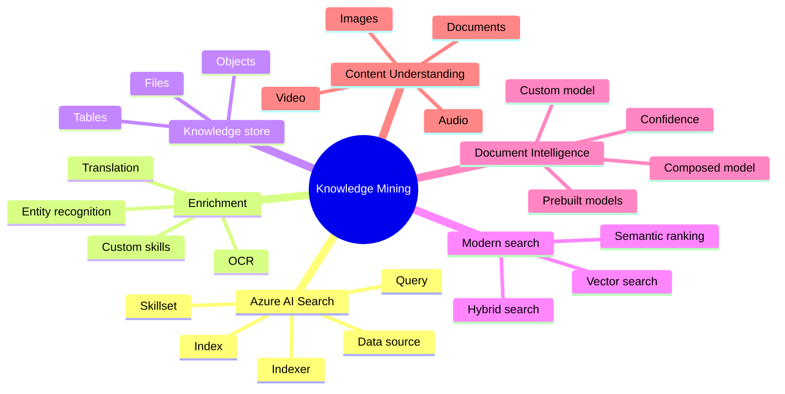
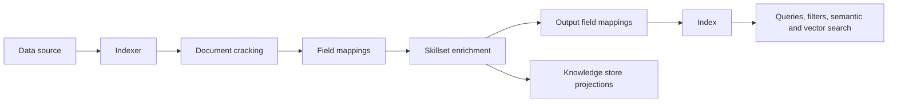
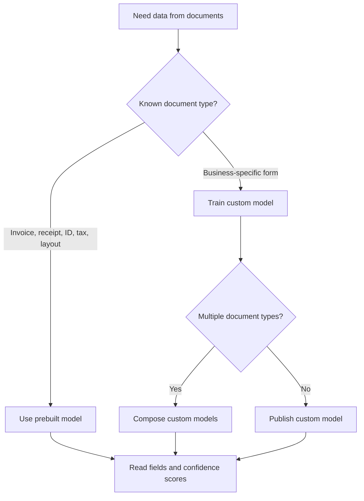

# Implement Knowledge Mining And Information Extraction Solutions

> Maps to AI-102 measured skill **Implement knowledge mining and information extraction solutions** (~15-20%).
> Reference: [Microsoft Learn AI-102 study guide](https://learn.microsoft.com/credentials/certifications/resources/study-guides/ai-102) - [Azure AI Search](https://learn.microsoft.com/azure/search/search-what-is-azure-search) - [AI enrichment with skillsets](https://learn.microsoft.com/azure/search/cognitive-search-concept-intro) - [Knowledge store](https://learn.microsoft.com/azure/search/knowledge-store-concept-intro) - [Azure AI Document Intelligence](https://learn.microsoft.com/azure/ai-services/document-intelligence/overview) - [Azure AI Content Understanding](https://learn.microsoft.com/azure/ai-services/content-understanding/overview).

Knowledge mining combines ingestion, enrichment, indexing, querying, and projections. This domain also includes Document Intelligence and Content Understanding for extracting structured information from documents and multimodal files.

## AI Search Pipeline

## Search Components

| Component | Job |
| --- | --- |
| Data source | Connection to supported data such as Blob Storage, SQL, or Cosmos DB. |
| Index | Searchable schema with fields, analyzers, filters, facets, vectors. |
| Indexer | Pulls data, cracks documents, runs field mappings and skillsets. |
| Skillset | Enrichment steps such as OCR, language, entities, translation, or custom web API skills. |
| Knowledge store | Persists enriched outputs as tables, objects, or files for downstream analysis. |
| Synonym map | Maps equivalent terms for query expansion. |
| Suggester | Enables autocomplete and search-as-you-type. |

## Query Feature Clues

| Requirement | Feature |
| --- | --- |
| Search equivalent terms | Synonym map. |
| Autocomplete or typeahead | Suggester plus autocomplete API. |
| Rank by meaning, not just keywords | Semantic ranking. |
| Find similar content by embedding | Vector search. |
| Combine exact keywords and semantic similarity | Hybrid search. |
| Restrict results by metadata | Filters and filterable fields. |
| Group counts by category | Facets and facetable fields. |

## Document Intelligence Decision Tree

## Custom Skills

| Requirement | Pattern |
| --- | --- |
| Built-in skill does not exist | Create a custom skill as a web API. |
| Skill output feeds index fields | Use output field mappings. |
| Skill output should be stored for analysis | Add knowledge store projections. |
| Skill handles language, sentiment, or domain processing | Enrichment tree passes document context to the custom skill. |

## Gotchas

- Indexers push enriched content into an index; queries do not run skillsets.
- Search analyzers affect tokenization; suggesters enable autocomplete.
- Knowledge store projections are for enriched output persistence, not for serving search queries.
- Document Intelligence extracts structured fields; AI Search makes content discoverable.
- Use the same embedding strategy for vector indexing and vector querying.

---

## References (Microsoft Learn)

- [AI-102 study guide](https://learn.microsoft.com/credentials/certifications/resources/study-guides/ai-102)
- [Azure AI Search overview](https://learn.microsoft.com/azure/search/search-what-is-azure-search)
- [Indexers](https://learn.microsoft.com/azure/search/search-indexer-overview) - [Skillsets](https://learn.microsoft.com/azure/search/cognitive-search-working-with-skillsets) - [Built-in skills](https://learn.microsoft.com/azure/search/cognitive-search-predefined-skills)
- [Knowledge store](https://learn.microsoft.com/azure/search/knowledge-store-concept-intro)
- [Semantic ranking](https://learn.microsoft.com/azure/search/semantic-search-overview) - [Vector search](https://learn.microsoft.com/azure/search/vector-search-overview)
- [Suggesters and autocomplete](https://learn.microsoft.com/azure/search/index-add-suggesters)
- [Synonym maps](https://learn.microsoft.com/azure/search/search-synonyms)
- [Azure AI Document Intelligence](https://learn.microsoft.com/azure/ai-services/document-intelligence/overview)
- [Prebuilt vs custom Document Intelligence models](https://learn.microsoft.com/azure/ai-services/document-intelligence/concept-model-overview)
- [Azure AI Content Understanding](https://learn.microsoft.com/azure/ai-services/content-understanding/overview)
