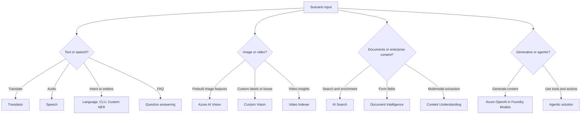

# AI-102 Exam Decision Reference

A condensed decision reference for the AI-102 measured skill areas. Use it for a focused review before the exam, or as a team-friendly summary of the service-fit decisions Microsoft tests most often. Aligned to the [Microsoft Learn AI-102 study guide](https://learn.microsoft.com/credentials/certifications/resources/study-guides/ai-102). For each clue, name the service before checking the answer column.

## Fast Service Picks

| Clue | Pick |
| --- | --- |
| Chat over private PDFs with citations | Azure OpenAI plus Azure AI Search RAG. |
| Extract invoice fields | Document Intelligence prebuilt invoice model. |
| Extract fields from a custom business form | Document Intelligence custom model. |
| Multiple custom form types in one endpoint | Composed Document Intelligence model. |
| Search documents with OCR, translation, entities | Azure AI Search indexer plus skillset. |
| Store enrichment output as tables/files/objects | Knowledge store projections. |
| Autocomplete | Suggester and autocomplete API. |
| Equivalent terms | Synonym map. |
| Intent classification for bot commands | CLU. |
| Domain-specific entity extraction | Custom NER. |
| FAQ bot | Custom question answering. |
| Text translation | Translator. |
| Spoken audio to text | Speech to text. |
| Text to natural voice | Text to speech with SSML for control. |
| Classify image into categories | Custom Vision classification. |
| Locate objects in image | Custom Vision object detection. |
| Get video transcript, topics, keywords, labels | Video Indexer. |
| Detect unsafe prompt or output | Content Safety, filters, prompt shields. |
| Tool-using autonomous workflow | Agent service or Agent Framework. |

## One-Screen Decision Tree

## Wrong-Answer Traps

| Trap | Correction |
| --- | --- |
| "OCR from document" always means Document Intelligence | OCR from images can be Vision; structured form fields mean Document Intelligence. |
| "Language detection" always means Language | Translator can detect language when translation is part of the workflow. |
| "Search" always means AI Search only | RAG usually combines AI Search with Azure OpenAI. |
| "Custom model" always means fine-tuning | Custom Vision, custom speech, custom NER, custom translation, and Document Intelligence custom models are different. |
| "Bot" always means generative AI | Many bot scenarios use CLU and question answering without generative models. |
| "Safer AI" only means content filter | Also consider prompt shields, blocklists, PII, monitoring, and governance. |

## Magic Words

| Words in question | Think |
| --- | --- |
| `skillset`, `indexer`, `enrichment tree` | AI Search. |
| `confidence score`, `labeled forms`, `composed model` | Document Intelligence. |
| `utterance`, `intent`, `entity`, `prebuilt domain` | CLU. |
| `alternate phrasing`, `multi-turn`, `chit-chat` | Question answering. |
| `precision`, `recall`, `probability threshold` | Custom Vision metrics. |
| `SSML`, `voice style`, `pronunciation` | Speech synthesis. |
| `prompt shield`, `groundedness`, `harm category` | Content Safety and Responsible AI. |
| `temperature`, `top_p`, `max tokens` | Generative model behavior. |
| `tools`, `orchestrator`, `autonomous` | Agentic solution. |
