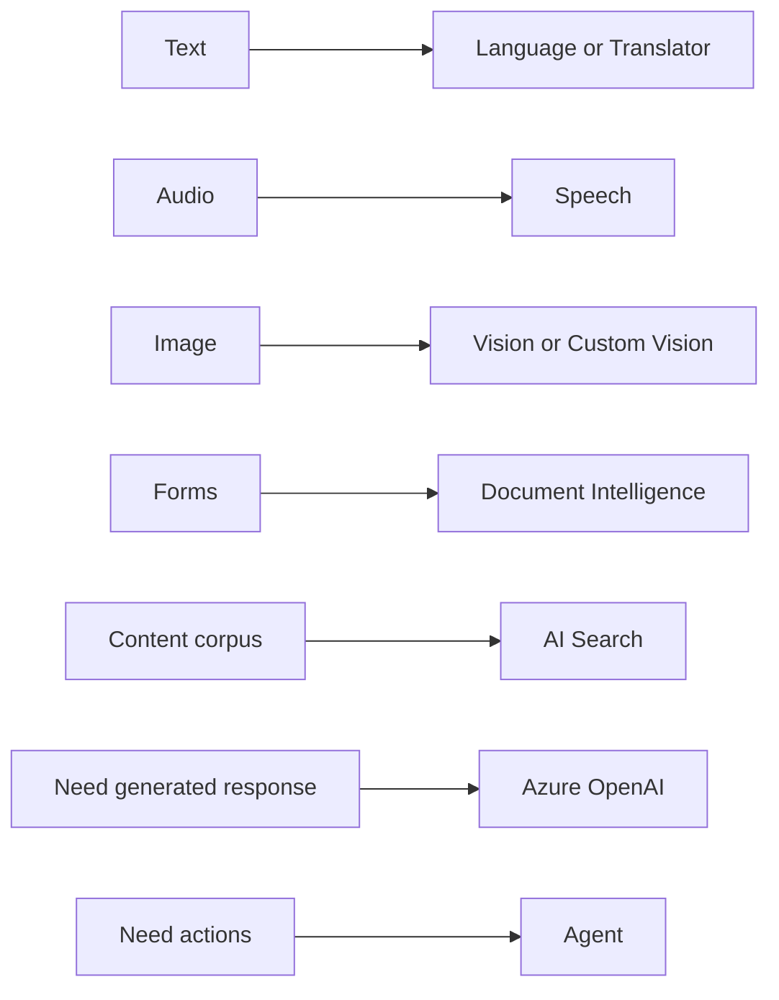
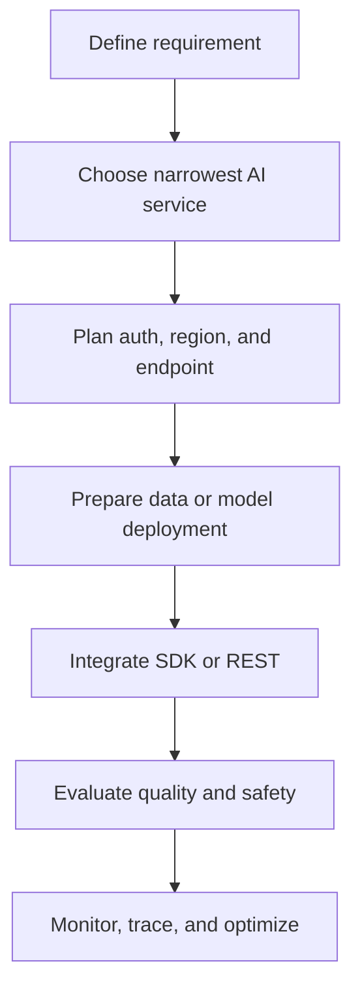

# Extra AI-102 Concepts

These are the ideas that make exam answers easier to eliminate even when the question wording is new.

## Old Names And New Names

| Older wording you may see | Current mental model |
| --- | --- |
| Cognitive Services | Azure AI services or Microsoft Foundry Services. |
| Azure AI Search | Azure AI Search. |
| Azure AI Document Intelligence | Azure AI Document Intelligence. |
| QnA Maker | Custom question answering. |
| LUIS | Conversational Azure AI Language CLU. |
| Azure OpenAI Service | Azure OpenAI in Foundry Models in newer exam wording. |

## Input-To-Service Mental Model

## Responsible AI Principles

| Principle | Exam translation |
| --- | --- |
| Fairness | Evaluate and reduce unfair performance differences. |
| Reliability and safety | Test, monitor, fail safely, prevent harmful outcomes. |
| Privacy and security | Protect data, credentials, endpoints, and PII. |
| Inclusiveness | Design for diverse users, languages, abilities, and contexts. |
| Transparency | Explain capabilities, limitations, confidence, and data use. |
| Accountability | Assign owners, reviews, approvals, and incident processes. |

## Search Schema Flags

| Flag | Meaning |
| --- | --- |
| searchable | Full-text search can tokenize and search this field. |
| filterable | Can be used in filter expressions. |
| sortable | Can sort by this field. |
| facetable | Can return category counts. |
| retrievable | Can appear in results. |
| vector field | Stores embeddings for vector similarity. |

## Practical Elimination Rules

- If the output needs bounding boxes, avoid plain classification.
- If the output needs structured key-value fields from forms, avoid plain OCR alone.
- If a question asks for equivalent search terms, avoid analyzers and pick synonyms.
- If a question asks for typeahead, avoid filters and pick suggesters.
- If a bot must know user intent, avoid sentiment and pick CLU.
- If a solution must answer from private documents, avoid asking the model alone and use retrieval grounding.
- If a solution must take actions, plain chat completion is incomplete; add agent/tool orchestration.

## Quick Build Pattern For AI Apps

## What To Memorize Last

- Service names and old-to-new mapping.
- Difference between CLU, Custom NER, and question answering.
- Difference between AI Search index, indexer, skillset, and knowledge store.
- Difference between OCR, Document Intelligence, and Content Understanding.
- Difference between RAG, fine-tuning, prompt engineering, and agents.
- Which settings affect generative output: temperature, top-p, max tokens, system prompt.
