# Microsoft Learn Summaries

Tight, exam-focused summaries of every major service covered in this AI-102 guide, structured the way Microsoft Learn presents them: **Overview -> Components -> Key concepts -> Integrations**. Each section includes a recreated architecture diagram (Microsoft's diagrams are not redistributed; concepts are summarized in our own words and visualized in Mermaid). Every section links back to the source Microsoft Learn page.

> Use this page when you want a 60-second refresher on a service before diving into the domain pages.

---

## 1. Azure AI Foundry

Source: [What is Azure AI Foundry?](https://learn.microsoft.com/azure/ai-foundry/what-is-azure-ai-foundry)

Unified platform for building, evaluating, deploying, and operating AI apps and agents. Successor / superset of Azure AI Studio with project-scoped resources, model catalog, agents, evaluations, and content safety.

### Components

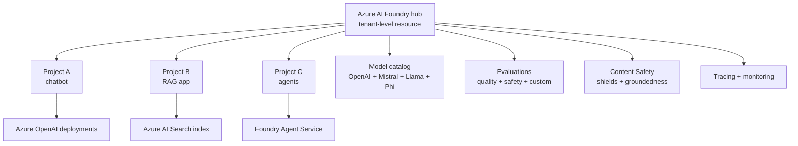

### Key concepts

- **Hub vs Project** - hub holds shared infrastructure (storage, Key Vault, AI Services), projects are isolated workspaces.
- **Connections** - link to Azure OpenAI, AI Search, Storage, Cognitive Services with managed identity.
- **Model catalog** - first-party (Azure OpenAI), open-source (Llama, Mistral, Phi), partner (Cohere, NVIDIA NIM).
- **Deployment types** - Standard (PTU + pay-as-you-go), Provisioned, Batch, Serverless.
- **Evaluation flows** - built-in (groundedness, relevance, coherence, fluency, safety) + custom.
- **Foundry Agent Service** - managed agents with tools, knowledge, threads, and orchestration.

---

## 2. Azure OpenAI Service

Source: [What is Azure OpenAI Service?](https://learn.microsoft.com/azure/ai-services/openai/overview)

OpenAI's GPT-4o, GPT-4.1, o-series, embeddings, DALL-E, Whisper, and Sora delivered with Azure security, regional control, content filters, and enterprise networking.

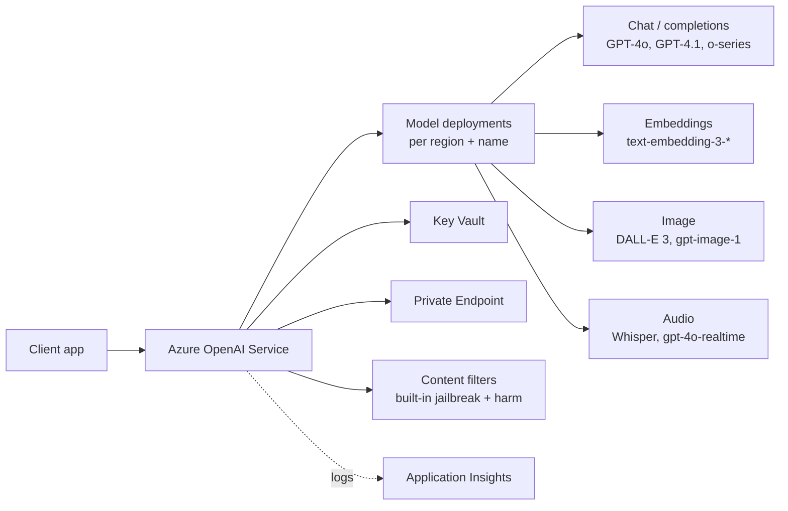

### Key concepts

- **Capacity types**: Standard (regional), Global Standard (cross-region), **Provisioned Throughput Units (PTU)** for predictable latency.
- **Quotas** are per-region per-model in TPM (tokens/minute).
- **Content filters** - categories (hate, sexual, violence, self-harm) + jailbreak + protected material; configurable severity.
- **Identity** - `Cognitive Services User` / `OpenAI User` role; **disable key auth**, use managed identity.
- **Bring Your Own Data (BYOD)** - first-class RAG against AI Search / blob / Cosmos DB.

---

## 3. Azure AI Search

Source: [What is Azure AI Search?](https://learn.microsoft.com/azure/search/search-what-is-azure-search)

Managed retrieval engine: full-text + vector + hybrid + semantic ranking. The de-facto retrieval store for enterprise RAG on Azure.

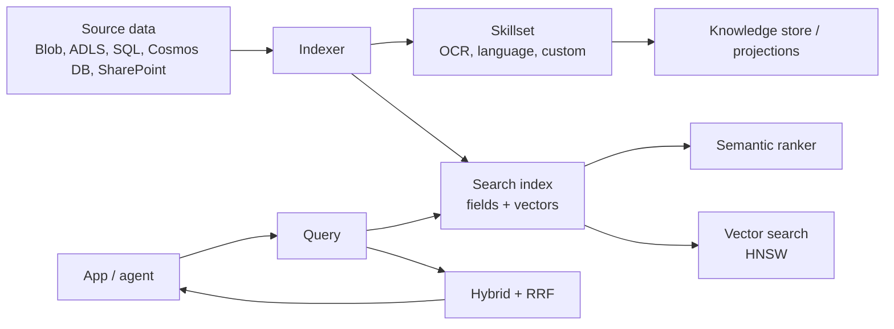

### Key concepts

- **Index** - schema with searchable, filterable, facetable, sortable, retrievable, vector fields.
- **Indexer + skillset** - pull mode with built-in cognitive skills + custom Web API skills.
- **Vector search** - HNSW or exhaustive KNN; integrated vectorization at index + query time.
- **Hybrid + RRF** - combine BM25 + vector results via Reciprocal Rank Fusion.
- **Semantic ranker** - Microsoft cross-encoder L2 reranker; great accuracy lift for RAG.
- **Security** - RBAC data plane, customer-managed keys, private endpoints, document-level security via filters.

### When to choose

| Need | Pattern |
|---|---|
| RAG over enterprise content | AI Search index + Azure OpenAI BYOD |
| Fully managed, no ETL | Indexer + skillset |
| Multi-tenant search | Per-tenant filter on a security trim field |

---

## 4. Azure AI Services (multi-service / individual)

Source: [What are Azure AI services?](https://learn.microsoft.com/azure/ai-services/what-are-ai-services)

Family of REST + SDK APIs covering vision, language, speech, decision, and generative scenarios. You can provision a **multi-service** Azure AI Services resource (one key for all) or individual resources for narrow scope.

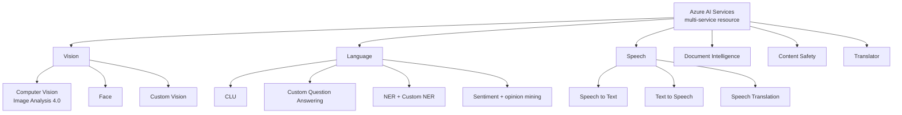

### Concepts (exam-relevant)

- **Single-service vs multi-service** - pricing and quota differ; multi-service simplifies key management.
- **Key vs Microsoft Entra auth** - prefer managed identity + Cognitive Services User role.
- **Customer-managed keys** + **VNet / Private Endpoint** + **disable public access** for compliance.
- **Data residency** - region selection determines storage + processing location.
- **Container deployment** - many AI services ship Docker images for disconnected / on-prem (commitment tier or connected billing).

---

## 5. Azure AI Vision (Image Analysis 4.0)

Source: [What is Image Analysis?](https://learn.microsoft.com/azure/ai-services/computer-vision/overview-image-analysis) - [Florence model](https://learn.microsoft.com/azure/ai-services/computer-vision/concept-image-analysis-overview)

Florence-foundation-model-based image understanding: caption, dense captions, tags, objects, OCR, smart crops, people detection, and **multimodal embeddings**.

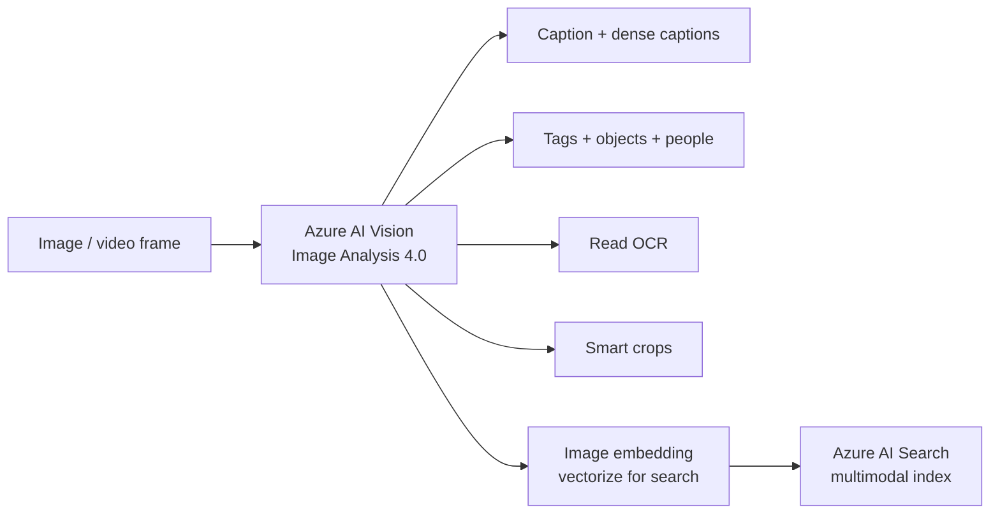

### Concepts

- **Florence** powers 4.0; better accuracy and zero-shot capabilities than 3.x.
- **Read API** - async OCR for printed + handwritten text.
- **Spatial Analysis** - counts and dwell time from camera feeds (containerized).
- **Custom Vision** - separate service for trainable image classification + object detection.

---

## 6. Azure AI Document Intelligence

Source: [What is Document Intelligence?](https://learn.microsoft.com/azure/ai-services/document-intelligence/overview)

Extract text, key-value pairs, tables, and structured fields from documents using prebuilt or custom models.

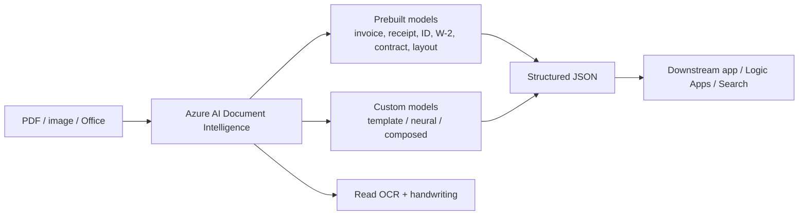

### Concepts

- **Layout** - universal model for tables, selection marks, structure (great as a RAG preprocessor).
- **Prebuilts** - invoices, receipts, IDs, W-2, 1098, contracts, health insurance card, marriage certificates, etc.
- **Custom template** - fixed-layout forms; **Custom neural** - variable layouts.
- **Composed model** - route to the right custom model automatically.
- **Add-on capabilities** - query fields (LLM-powered), barcode, formulas, font, language.

---

## 7. Azure AI Language

Source: [What is Azure AI Language?](https://learn.microsoft.com/azure/ai-services/language-service/overview)

One Language resource consolidates many NLP capabilities: prebuilt + custom.

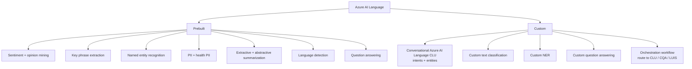

### Concepts

- **CLU** replaces LUIS for new projects; multilingual, model-versioned, exportable.
- **Custom Question Answering** replaces QnA Maker; backed by Azure AI Search.
- **Orchestration workflow** - single endpoint that dispatches utterances to the right child project.
- **Language Studio** - authoring UX for all custom projects.
- **Skills** - Language is exposed as built-in skills inside AI Search skillsets.

---

## 8. Azure AI Speech

Source: [What is the Speech service?](https://learn.microsoft.com/azure/ai-services/speech-service/overview)

Speech-to-text, text-to-speech, speech translation, speaker recognition, intent recognition, and **real-time + batch** APIs.

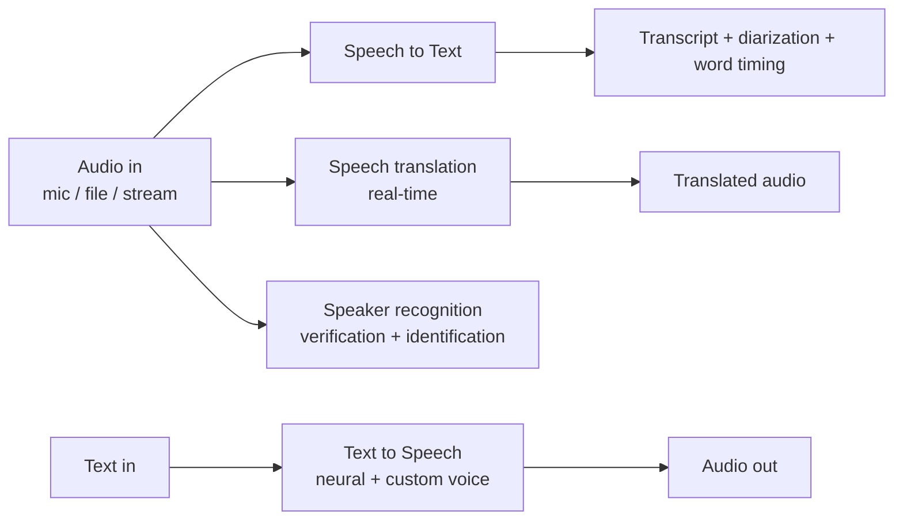

### Concepts

- **Real-time vs batch transcription** - batch for long files via REST.
- **Custom Speech** - fine-tune acoustic + language model with audio + transcripts; deploy custom endpoint.
- **Custom Neural Voice** - gated; build a brand voice from speaker recordings.
- **Pronunciation assessment** - language-learning scenarios.
- **Speech SDK** - same code path for STT / TTS / translation / intent.

---

## 9. Azure AI Translator

Source: [What is Translator?](https://learn.microsoft.com/azure/ai-services/translator/translator-overview)

Real-time + document translation across 100+ languages with optional **Custom Translator** models.

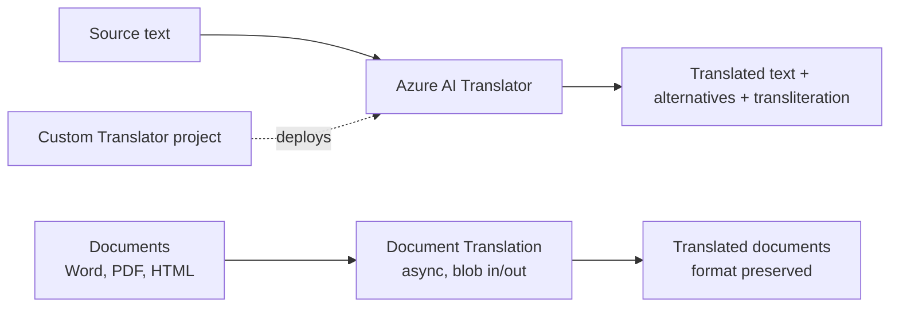

### Concepts

- **Text Translator** - synchronous; supports glossary, profanity filter, transliteration.
- **Document Translation** - async over blob containers; preserves layout.
- **Custom Translator** - domain-tuned model from parallel data; minimum sentence pair requirements.
- **Language detection** is built-in (no separate Language call needed for translate).

---

## 10. Azure AI Content Safety

Source: [What is Content Safety?](https://learn.microsoft.com/azure/ai-services/content-safety/overview)

Detect and filter harmful content (text + image), and protect LLM apps from jailbreak / indirect prompt injection / protected material leakage.

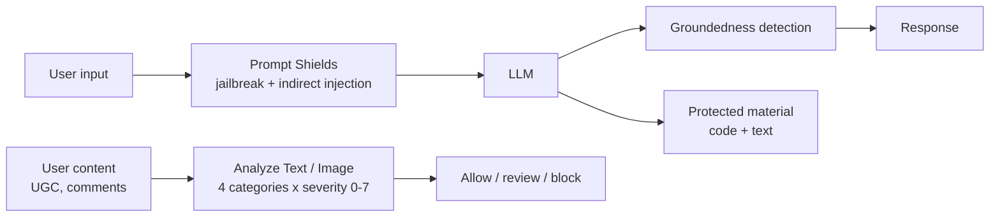

### Concepts

- **Categories** - Hate, Sexual, Violence, Self-Harm; severity 0-7.
- **Prompt Shields** - direct (jailbreak) + indirect (cross-domain) injection detection.
- **Groundedness detection** - verifies LLM outputs against grounding sources.
- **Custom categories** - train your own.
- Built into Azure OpenAI by default; surface independently for non-Azure-OpenAI workloads or UGC pipelines.

---

## 11. Foundry Agent Service

Source: [What is Azure AI Foundry Agent Service?](https://learn.microsoft.com/azure/ai-foundry/agents/overview)

Managed agents with tools, knowledge, threads, and orchestration - successor to Azure OpenAI Assistants.

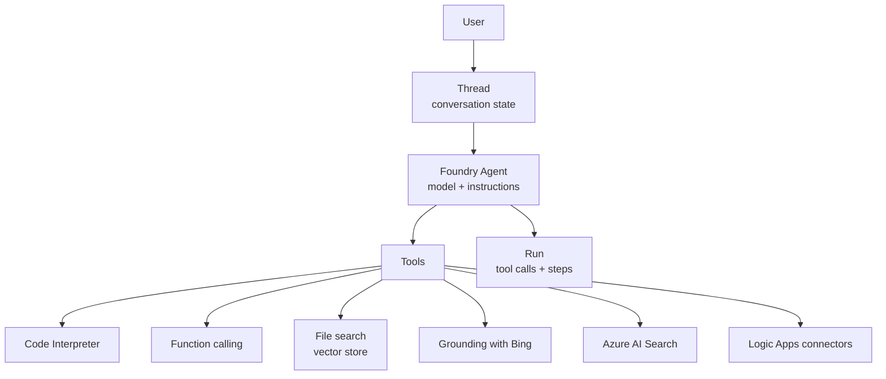

### Concepts

- **Threads + runs + messages + steps** - same primitives as Assistants v2.
- **Built-in tools** - code interpreter, file search, function calling, Azure AI Search, Bing grounding, Logic Apps, Azure Functions, Fabric data agents.
- **Bring-your-own model** - Azure OpenAI or model catalog.
- **Multi-agent** - orchestrate via connected agents, Semantic Kernel, or Microsoft Agent Framework.

---

## 12. Azure Machine Learning (positioning vs Foundry)

Source: [What is Azure Machine Learning?](https://learn.microsoft.com/azure/machine-learning/overview-what-is-azure-machine-learning)

Full-lifecycle ML platform: data prep, training, MLOps, deployment, monitoring. AI-102 surface is small but you should know **when** to pick AML vs Foundry.

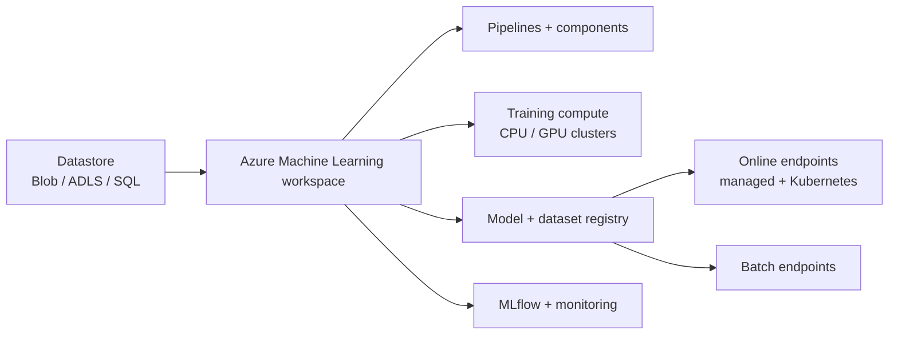

| Pick AML when | Pick Foundry when |
|---|---|
| Custom training, classical ML, deep learning | Building a GenAI app, RAG, or agent |
| MLOps with pipelines + model registry | Prompt iteration + evals + content safety |
| Need GPU clusters for fine-tuning | Calling foundation models + tools |

---

## 13. Azure AI integration with Azure Storage, Key Vault, and networking

Source: [Configure private link for AI Services](https://learn.microsoft.com/azure/ai-services/cognitive-services-virtual-networks)

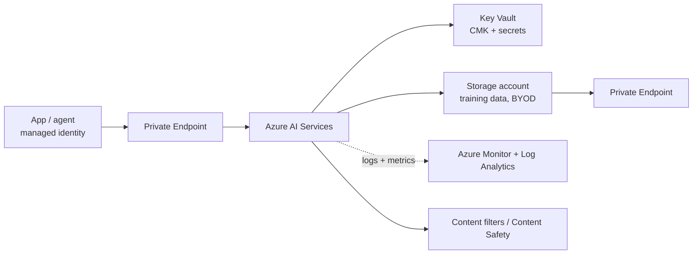

### Hardening checklist (exam favourites)

- **Disable key auth** -> use Microsoft Entra (managed identity).
- **Disable public network access** -> Private Endpoint only.
- **CMK** -> encryption with your Key Vault key.
- **Diagnostic settings** -> route logs to Log Analytics workspace.
- **Customer-managed VNet** for Foundry / AML where supported.
- **Data zone / region pinning** to meet residency.

---

## 14. Responsible AI lifecycle

Source: [Microsoft Responsible AI Standard](https://www.microsoft.com/ai/responsible-ai) - [Transparency notes](https://learn.microsoft.com/legal/cognitive-services/)

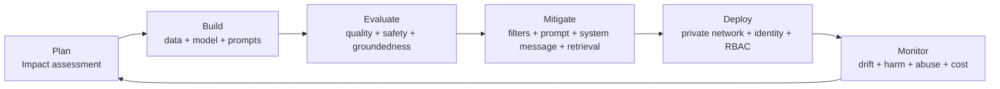

### Six principles (memorize)

1. **Fairness**
2. **Reliability and Safety**
3. **Privacy and Security**
4. **Inclusiveness**
5. **Transparency**
6. **Accountability**

### Practical exam mappings

| Concern | Mitigation |
|---|---|
| Hallucinations | RAG with AI Search + grounding + groundedness detection |
| Harmful content | Content filters + Prompt Shields + custom categories |
| Bias | Diverse eval set + fairness metrics + human review |
| PII leakage | PII detection + redaction + Customer Lockbox |
| Prompt injection | Prompt Shields + system message + tool allowlist + output filters |
| IP / copyright | Protected material detection + Customer Copyright Commitment |

---

## 15. AI gateway pattern with API Management

Source: [GenAI gateway capabilities in API Management](https://learn.microsoft.com/azure/api-management/genai-gateway-capabilities)

Place Azure API Management in front of LLM endpoints to govern many apps and many model deployments.

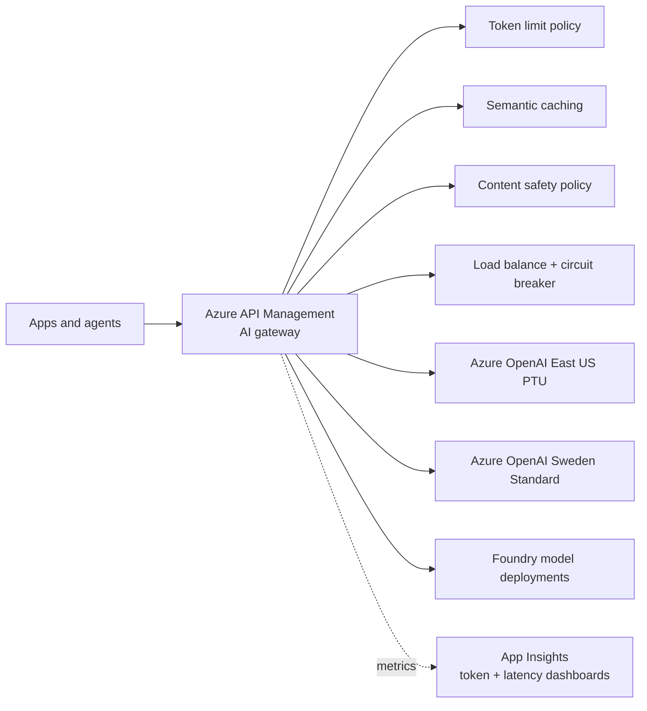

### Built-in LLM policies

- `azure-openai-token-limit` - per-key TPM caps.
- `llm-semantic-cache-lookup` / `store` - embedding-based cache.
- `azure-openai-emit-token-metric` - emit prompt / completion / total tokens to Application Insights.
- `llm-content-safety` - call Content Safety inline.
- `set-backend-service` with priority / weight + circuit breaker - multi-region failover.

---

## How to use this page on the exam

1. Spot the **service name** in the question.
2. Jump to that section here for the components diagram and key concepts.
3. Cross-check with the matching domain page (01-06) and the [Exam Decision Reference](07-exam-cheatsheet.md).
4. Pick the answer that matches the **least-moving-parts, fully-managed, identity-based, private-by-default, evaluated-and-monitored** pattern.

> Sources: every link in this page points to the official Microsoft Learn article it was summarized from. Diagrams here are original Mermaid recreations of the concepts on those pages.
